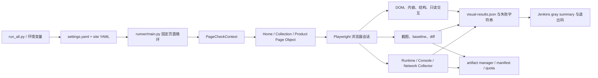
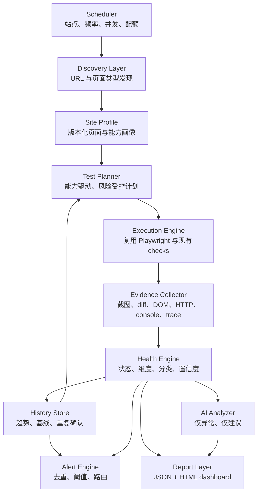

# Shopify Site Quality Monitor：AI 网站健康平台架构审查与增量演进方案

审查日期：2026-08-14
审查目标：从“Playwright UI 自动化能否跑通”升级为“AI 驱动的网站全面健康检查系统”。

## 1. 结论先行

当前项目不是空白工程，也不是需要推倒重来的脚本集合。它已经是一套较成熟的 Shopify 只读视觉回归与运行时诊断基础设施，但还不是完整的网站健康平台。

最准确的定位是：

> 当前系统是“配置驱动、证据留存较强的 Home/PLP/PDP Playwright 监控器”；它具备成为健康平台的执行层基础，但缺少通用发现、能力建模、统一健康语义、历史、趋势、告警和受控 AI 分析层。

本次采用 sidecar 增量架构：保留稳定的 Playwright 执行链、站点 YAML、selector、baseline、截图、diff、artifact、旧 JSON 和 Jenkins 退出语义，在其上新增统一健康模型与报告。没有重写既有 runner，也没有让 AI 自动修改 selector 或 baseline。

### 当前成熟度

| 领域 | 审查前状态 | 第一阶段后状态 | 结论 |
|---|---|---|---|
| Playwright 浏览器执行 | 成熟 | 保持 | 应继续复用 |
| Home / PLP / PDP 检查 | 成熟但固定 | 保持并结构化观测 | 可作为首批页面适配器 |
| 视觉 baseline 治理 | 较成熟 | 保持 | 不应交给 AI 自动更新 |
| DOM / 内容 /只读交互 | 已有但语义分散 | 纳入统一 observation | 可继续扩展 |
| Runtime / Network | 较成熟 | 纳入统一分类与证据 | 仍需跨运行确认 |
| Page Capability Detection | 不存在，只有隐式配置 | 已有确定性配置检测器 | 仍缺 live discovery |
| 统一 Health Model | 不存在 | 已建立 | P0 已完成基础 |
| 误报控制 | 局部、分散 | 已建立中央策略 | 仍需历史数据校准 |
| AI 分析 | 不存在 | 接口已建立，默认关闭 | 仍未接真实 provider |
| 历史 / 趋势 / 告警 / 调度 | 不存在 | 明确标为 UNVERIFIED | 后续阶段建设 |
| 性能 / 无障碍 / SEO | 不存在 | 明确标为 UNVERIFIED | 不得伪报 PASS |

## 2. 审查范围与事实基线

本次检查覆盖：

- 根入口、CLI、runner 与退出码；
- 全部站点 YAML 与全局 settings；
- Home、Collection、Product page object 和 check；
- selector、DOM presence、structure region、readonly interaction；
- baseline 初始化保护、视觉比对、动态内容策略和 diff；
- runtime collector、网络事件、console、pageerror、导航与证据脱敏；
- artifact manager、保留策略、配额、manifest；
- JSON 结果、gray summary 与 Jenkinsfile；
- 现有单元测试与浏览器集成测试；
- Search、Cart、Login 等占位 flow；
- 项目内所有与 AI、LLM、Codex、自修复、历史、趋势和告警有关的实现。

审查时的可验证事实：

- 站点配置：6 个；
- runner 正式支持页面：Home、Collection/PLP、Product/PDP，共 3 类；
- 默认 viewport：desktop、mobile；
- 改造前回归测试：197 项全部通过；
- 6 个站点的配置校验均通过；
- 本地 `artifacts/` 中存在 63 个运行目录，占用约 2.30 GB；
- 项目内没有真实 AI provider、历史数据库、趋势引擎或告警通道；
- Jenkins 是 Mondressy US 的单站点灰度流水线，不是多站点 scheduler。

## 3. 当前真实架构

### 组件职责

| 组件 | 当前职责 | 限制 |
|---|---|---|
| `run_all.py` | CLI 参数、配置验证、启动 runner | 页面类型硬编码为 3 类 |
| `runner/main.py` | viewport × page 循环、整页重试、退出码 | 重试依赖 failure string；没有 planner |
| `PageCheckContext` | 合并页面配置、路径、截图 policy、artifact manager | 与固定 page check 耦合 |
| Page Objects | URL、selector、页面 readiness 和部分业务状态 | 站点差异通过大量 YAML/CSS 适配 |
| Check modules | DOM、内容、结构、插件、只读交互、截图 | 非视觉失败过去主要只存在于控制台字符串 |
| Runtime session | 导航、HTTP、request failed、console、pageerror、dialog、crash | 分类是单次运行局部规则，缺少历史确认 |
| Visual layer | baseline、mask、layout-only、diff、purpose/gate | 适合继续作为确定性证据，不适合 AI 自动改基线 |
| Artifact manager | 临时文件、保留、配额、manifest、安全边界 | 限制单次运行，不负责跨运行生命周期 |
| Jenkins | 单站点灰度运行、证据归档、结果裁决 | 没有 cron、多站点编排、趋势与告警 |

## 4. 值得保留的成熟能力

### 4.1 Baseline 安全性

- baseline 缺失默认失败，不会静默把当前页面当成正确结果；
- CI 初始化 baseline 需要显式双重开关；
- 已存在 baseline 不会被普通运行自动覆盖；
- `gate`、`report_only`、`evidence_only`、`structure_only` 语义已分离；
- 动态内容支持 `mask_content`、`layout_only`、`ignore_visual`，能把业务内容变化与结构破坏分开。

这部分是项目最有价值的资产之一，后续只能增强治理和审计，不能改成 AI 自动接受新基线。

### 4.2 Runtime 与证据收集

- 在导航前注册 console、pageerror、requestfailed、HTTP response、dialog、crash 监听；
- 对 URL query、认证头和敏感文本做脱敏；
- 保留 attempt 与 summary，能表达重试前后的状态；
- 对第三方 aborted request、图片 abort、favicon 等已有噪声过滤；
- terminal page 能保留最小异常截图和运行时 JSON；
- collector 或证据写入失败采用 fail-open，不篡改视觉测试结果。

### 4.3 Artifact 工程质量

- 临时目录、页面目录、运行目录边界明确；
- 对路径逃逸和跨文件系统 move 有防护与测试；
- 对通过、内容变化、警告、失败使用不同保留策略；
- 有单页、单站点、单运行图像数量与字节配额；
- 失败时可以提升保留上下文截图。

### 4.4 回归与配置基础

- 大量行为通过 unittest 和 Playwright fixture 固化；
- 配置校验覆盖 selector shape、runtime policy、viewport、baseline 目录等；
- desktop/mobile 分开存储 baseline 和 artifact；
- Jenkins 对凭据注入、运行范围、summary 优先级和归档范围有静态测试。

## 5. 十个最大架构限制

1. **页面范围固定**：正式 runner 只认识 Home、PLP、PDP；Search、Cart、Login 只是占位 flow，无法通过通用 profile 扩展。
2. **没有真正的发现层**：系统不会自动发现 URL、页面类型、组件或功能，只消费人工写好的固定配置。
3. **能力是隐式的**：是否有筛选、排序、变体、加购、抽屉等信息散落在 modules、selector 和函数调用里。
4. **结果模型碎片化**：视觉结果、runtime page summary、控制台 failure string、artifact manifest 各自表达一部分事实。
5. **非视觉证据曾经缺失**：DOM、内容、分页、插件、加购状态失败会影响退出码，却不一定进入可机器消费的结果记录。
6. **分类仍是单次规则**：WAF、限流、网络瞬断、selector 漂移、站点真实故障之间缺少跨运行和第二观测点确认。
7. **交互权限过粗**：过去主要依赖全局 side-effect 开关，没有统一的 SAFE / TRANSACTIONAL_SAFE / HIGH_RISK 决策接口。
8. **没有 AI 层**：审查前没有 LLM provider、按需调用、输入裁剪、自修复建议合同或人工审批边界。
9. **没有平台闭环**：缺少 history store、趋势、健康分数校准、告警去重、scheduler、多租户与站点生命周期管理。
10. **运营扩展风险高**：本地 artifact 已约 2.30 GB；Jenkins 固定单站点全量范围，继续增加站点会线性放大时间、存储和误报。

## 6. “现在能跑，但长期不稳”的部分

- Home/PLP/PDP 的 Python check 含站点特定稳定化 CSS、动画禁用和截图前处理；新增主题或组件后容易继续堆条件分支。
- selector 由人工配置，缺少 selector provenance、版本和能力级 fallback；DOM 一变就可能被误判为站点故障。
- runner 通过 failure 文本匹配决定是否整页重试，分类和重试策略没有共享同一套 reason code。
- 每个页面通常重新创建浏览器上下文；站点扩张后启动成本和 WAF 压力会显著增加。
- 同一检查中既承担浏览器动作，又承担业务断言、截图、artifact 和退出码组装，难以按能力动态编排。
- 一些历史函数没有进入正式运行路径，例如 Home plugin capture、Collection card/hover capture；维护者难以判断是备用功能还是死代码。
- `search_flow.py`、`cart_flow.py`、`login_flow.py` 是占位文件，容易造成“已经覆盖”的错误认知。
- 旧 baseline fallback 与兼容 shim 仍在，若长期不设淘汰日期会扩大迁移矩阵。
- runtime party classification 使用本地 root-domain 规则，面对公共后缀、Shopify CDN、代理域名时仍可能误分类。
- artifact 配额主要约束单次运行，没有跨运行 TTL、总容量水位和远端对象存储生命周期。

## 7. 缺失能力与健康维度覆盖

| 健康维度 | 当前确定性信号 | 第一阶段输出 | 仍需建设 |
|---|---|---|---|
| Availability | 导航、HTTP、终止页 | PASS/FAIL/BLOCKED/FLAKY | 多观测点与连续失败确认 |
| Page Health | 固定页面 readiness | 聚合状态 | 通用页面类型和完整性合同 |
| Functional | 菜单、筛选、变体、加购状态等 | 结构化 observation | 通用 capability planner |
| Visual | baseline、diff、结构检查 | 统一 finding/evidence | 变化归因和人工审批工作流 |
| DOM / Content | modules、presence、产品内容 | 结构化 finding | live semantic discovery |
| Runtime | console、pageerror、crash、dialog | 统一分类 | 版本化噪声知识库 |
| Network | failed request、HTTP error、party | 统一分类 | HAR/trace 关联、跨运行确认 |
| Performance | 无 | UNVERIFIED | Web Vitals、资源瀑布、预算 |
| Responsive | desktop/mobile 各自运行 | UNVERIFIED | 跨 viewport 断点和溢出聚合 |
| Accessibility | 无 | UNVERIFIED | axe/ARIA/键盘流程与严重度规则 |
| SEO | 无 | UNVERIFIED | title/meta/canonical/robots/schema |
| Commerce | PDP 部分状态、可选加购 flow | UNVERIFIED | cart/checkout-entry 合同与隔离数据 |
| Test System | collector、artifact、异常 | 统一 UNVERIFIED 分类 | runner 自监控、容量和依赖健康 |

原则：没有采集的数据必须是 `UNVERIFIED`；对不适用页面才使用 `NOT_APPLICABLE`。不得因为脚本没有检查就返回 PASS。

## 8. 主要风险与控制策略

| 风险 | 影响 | 当前/新增控制 | 后续要求 |
|---|---|---|---|
| WAF/安全挑战被当成宕机 | 严重误报 | 分类为 BLOCKED，不发站点事故告警 | 连续确认、allowlist、第二网络点 |
| 单次网络错误被称为 SITE_DOWN | 严重误报 | 第一阶段降为 NETWORK_TRANSIENT/FLAKY | 历史阈值与多点确认 |
| selector 漂移被当成 UI bug | 错误派单 | 分类为 SELECTOR_CHANGED/UNVERIFIED | live DOM 复核和人工批准 |
| 第三方脚本噪声 | 告警疲劳 | third-party suppression | 仅在核心 capability 受影响时升级 |
| 业务内容正常变化 | 视觉误报 | content_changed/EXPECTED_CHANGE | 日历、发布事件与审批记录 |
| AI 幻觉式修复 | 测试失真或 baseline 污染 | 默认关闭、只读请求、建议不应用 | 候选验证、审批、审计日志 |
| 高风险自动交互 | 订单、登录、提交副作用 | HIGH_RISK 默认拒绝 | 专用测试账户和隔离环境 |
| Artifact 无限增长 | 磁盘耗尽、CI 失败 | 单次配额 | 跨运行 TTL/容量水位/对象存储 |
| 假健康分数 | 管理决策失真 | 第一阶段 score 明确 DEFERRED | 至少数周历史和误报校准后启用 |

## 9. 目标架构

### 9.1 Discovery Layer

职责：发现站点入口、sitemap/导航链接、页面候选和页面类型。第一版应以 sitemap、已审配置和 URL pattern 为主，AI 只能处理无法确定的候选。发现结果不能直接执行高风险动作。

### 9.2 Site Profile

职责：保存站点、域名、页面类型、canonical URL、能力、selector 来源、预期业务状态、viewport、认证需求和 interaction policy。Profile 必须版本化并可审核。

### 9.3 Test Planner

职责：根据能力画像生成测试计划，而不是按固定 Python 文件循环。每个计划项至少包含 capability、检查器、风险级别、证据要求、timeout、retry policy 和 gate policy。

### 9.4 Execution Engine

职责：继续复用现有 Playwright、page object、check、runtime hooks 和 artifact manager。第一阶段不改变原有执行语义；后续通过 adapter 将固定 check 逐步注册成 capability check。

### 9.5 Evidence Collector

职责：统一引用 screenshot、diff、URL、HTTP、selector probe、DOM snapshot、console、network、metric、trace、log 和 runtime artifact。所有敏感字段在进入 AI、报告或远端存储前脱敏。

### 9.6 Health Engine

职责：将 observation 转换成 health finding，输出状态、严重度、分类、置信度、业务影响、证据级别和建议。它不能靠模糊分数掩盖缺失维度。

### 9.7 AI Analyzer

职责：只处理异常 finding 的有限结构化证据，用于归因、摘要、推荐行动和 selector 候选建议。它没有浏览器执行权、配置写权限或 baseline 写权限。

### 9.8 History Store

职责：保存运行、页面、能力、finding 指纹、首次/最近出现、连续次数、恢复时间、发布标记和证据 URI。历史是趋势、flaky 判断和可靠告警的前置依赖。

### 9.9 Report Layer

职责：输出机器可读 JSON 与面向运营/研发的 HTML dashboard；显示 Overall Health、维度、关键问题、页面健康、证据、变化、AI 状态和建议行动。

### 9.10 Alert Engine

职责：仅对证据充分、影响明确、满足重复确认或多点确认的 finding 发告警；支持抑制、合并、恢复通知和责任团队路由。

### 9.11 Scheduler

职责：按站点价值和风险分层调度，控制并发、频率、WAF 压力、运行预算和 artifact 生命周期。Jenkins 可继续作为初期执行器，但不应永久承担平台数据库与调度职责。

## 10. 统一数据与状态语义

第一阶段引入以下状态：

- `PASS`：检查已执行且有确定性通过证据；
- `WARN`：存在异常但影响或置信度不足；
- `FAIL`：确定性证据支持真实故障；
- `BLOCKED`：监控被 WAF、限流或访问条件阻断，不等同公共站点宕机；
- `FLAKY`：瞬态失败或重试后恢复；
- `EXPECTED_CHANGE`：业务内容或已知预期状态变化；
- `UNVERIFIED`：检查系统、selector、证据或能力覆盖不足；
- `NOT_APPLICABLE`：该维度对页面确实不适用。

主要故障分类包括：真实 UI/功能/站点故障、SITE_DOWN、WAF_BLOCK、RATE_LIMIT、SELECTOR_CHANGED、CONTENT_CHANGED、LAYOUT_CHANGED、THIRD_PARTY_NOISE、NETWORK_TRANSIENT、PERFORMANCE_REGRESSION、TEST_SCRIPT_ISSUE、TEST_ENVIRONMENT_ISSUE 和 EXPECTED_BUSINESS_STATE。

告警原则：只有 `FAIL` 且严重度高、业务影响明确、证据至少为 MEDIUM 的真实站点/UI/功能故障，才有资格进入站点事故告警。BLOCKED、FLAKY、selector、测试系统和第三方噪声默认不发站点事故告警。

## 11. 交互安全策略

| 级别 | 典型动作 | 默认策略 |
|---|---|---|
| SAFE | 导航、搜索输入不提交、筛选、排序、分页、菜单、抽屉、tab、accordion、变体选择 | 允许 |
| TRANSACTIONAL_SAFE | add-to-cart、cart drawer、数量修改、移除测试商品 | 必须显式 opt-in，并要求清理/幂等 |
| HIGH_RISK | buy-now、checkout、登录、账户修改、表单提交、订单/支付 | 默认拒绝，即使调用方请求也需要独立批准和环境隔离 |

现有 PDP 的“加购按钮状态检查”仍是只读 SAFE 观测；已有真正 add-to-cart flow 继续受原开关保护。后续应由统一 InteractionPolicy 包装，而不是让 AI 决定是否点击。

## 12. 视觉 baseline 与 AI 边界

必须长期保持：

1. baseline 只能通过显式人工/任务批准创建或更新；
2. AI 可以描述 diff、提出候选原因、建议 selector，但不能写文件；
3. selector 候选必须在隔离运行中验证稳定性、唯一性和能力结果；
4. 候选验证通过也不能自动合并，必须产出 reviewable patch；
5. content change、layout change 和真实 UI bug 必须分开；
6. 所有 baseline 变更记录来源运行、批准者、时间和适用 viewport。

第一阶段的配置校验会拒绝 `suggestions_only=false`、`approval_required=false` 或 `auto_apply=true`。

## 13. 本次第一阶段已实现

| 能力 | 实现位置 | 说明 |
|---|---|---|
| 统一健康数据模型 | `playwright_checks/health/models.py` | 状态、维度、页面、finding、证据、告警、AI、run report |
| 页面能力画像 | `health/capabilities.py` | 从审查过的配置确定性推导 page type 与 capability/risk |
| 结构化非视觉观测 | `health/observations.py` + 3 个 check | 不再只依赖 failure string |
| 证据模型 | `health/evidence.py` | URL、HTTP、截图、diff、selector、DOM、console、network、metric、trace |
| 故障分类 | `health/classification.py` | 将旧结果与 runtime finding 转换为统一语义 |
| 误报控制 | `health/false_positives.py` | WAF、限流、第三方、selector、预期变化、瞬态网络抑制 |
| Interaction Policy | `health/interaction_policy.py` | SAFE/TRANSACTIONAL_SAFE/HIGH_RISK |
| AI 接口 | `health/ai.py` | 默认关闭、仅异常调用、输入裁剪、建议不可自动应用 |
| Health Engine | `health/engine.py` | 按 site/page/viewport 聚合维度、finding、alert |
| JSON + HTML 报告 | `health/reporting.py` | Overall、维度、关键问题、页面、证据、AI、行动 |
| 配置与安全校验 | `configs/settings.yaml`、`run_all.py` | 验证报告、AI、误报和交互策略 |
| Runner/Jenkins 接入 | `runner/main.py`、`Jenkinsfile` | sidecar 生成与归档；不改变旧退出码 |
| 测试 | `tests/test_health_platform.py` | 13 个健康平台合同测试 |

兼容性边界：

- `reports/visual-results.json` 的旧数组格式继续存在；
- 原 Playwright failure、visual gate、runtime gate 和进程退出码继续决定 Jenkins 结果；
- 新报告生成失败采用 fail-open，仅输出 warning；
- 新健康报告写入 `reports/health-report.json`、`reports/health-report.html` 和当前 run artifact；
- AI 默认未启用，没有网络调用；
- 未实现的历史、性能、无障碍、SEO、响应式聚合继续明确显示为 UNVERIFIED；
- 健康分数延后，不生成未经校准的 0–100 分数。

## 14. 分阶段优先级

### P0：统一语义与安全边界（本次已完成基础）

- Health model、evidence、classification；
- capability profile v1；
- 非视觉 observation；
- false-positive control；
- interaction policy；
- AI adapter contract 与硬性只建议边界；
- JSON/HTML sidecar report；
- 不改变旧 gate 的兼容接入。

验收：旧测试全绿；六站点配置校验通过；无证据不产生 critical site alert；AI 无法自动应用建议。

### P1：从固定页面脚本走向能力驱动

- sitemap/配置/链接混合 Discovery v1；
- 版本化 Site Profile schema；
- capability check registry 与 planner；
- 把 Home/PLP/PDP 现有 check 包装成 adapter；
- 增加 Search、Cart、Content 页面类型；
- 引入性能、SEO、a11y 确定性采集；
- trace/HAR 仅在异常时保留。

验收：新增页面类型不需要修改 runner 固定 tuple；每个 capability 都能说明来源、风险、证据和覆盖状态。

### P2：历史、趋势与可信告警

- History Store；
- finding fingerprint、连续次数、恢复与发布关联；
- 多次/多点确认 SITE_DOWN；
- 告警抑制、合并、恢复通知和 ownership；
- 跨运行 artifact TTL、容量水位和对象存储；
- scheduler 的站点分层、并发和频率预算。

验收：网络瞬断和 WAF 不触发站点事故；趋势报告可追溯到原始 evidence；存储容量有硬上限。

### P3：受控 AI 增强

- 接入可替换 AI provider；
- 只对高价值异常做摘要和归因；
- selector 候选生成、隔离验证、reviewable patch；
- 发布事件与历史上下文辅助误报判断；
- 经校准后再设计健康分数。

验收：关闭 AI 时全部确定性功能完整；AI 失败不影响报告；任何配置/baseline 修改都需要显式批准并有审计记录。

## 15. 增量迁移路径

1. **Sidecar 双写**：保留旧结果与退出语义，同时生成 health report。本次已完成。
2. **Observation 补齐**：将所有决定退出码的检查逐步写成结构化 observation；先补 Home/PLP/PDP 核心项。
3. **Check Registry**：给现有函数加 capability adapter，不立即重写其浏览器逻辑。
4. **Profile 版本化**：把页面类型、能力、风险和 selector provenance 从隐式 YAML 字段提升为正式 schema。
5. **Planner 切换**：runner 先支持旧固定计划与新 capability plan 并行，再逐站点切换。
6. **新增确定性维度**：性能、a11y、SEO 先 report-only，完成校准后再决定 gate。
7. **历史与告警**：先存事实，再做趋势和告警；不能反过来用单次运行直接报警。
8. **AI 最后接入**：只消费统一 finding/evidence，不直接读取整个站点或控制 Playwright。

每一步都可以通过关闭 `health_check.enabled` 回退到旧 runner；baseline、站点 YAML 和旧 artifact 不需要迁移即可继续运行。

## 16. Jira 可执行任务拆分

| ID | 优先级 | 任务 | 关键验收 | 依赖 |
|---|---|---|---|---|
| HEALTH-101 | P1 | 定义 Site Profile v1 JSON Schema | page type、capability、risk、selector source 可验证和版本化 | P0 model |
| HEALTH-102 | P1 | 建立 Capability Check Registry | 新能力无需改 runner tuple；旧 check 可注册 | HEALTH-101 |
| HEALTH-103 | P1 | Discovery v1 | sitemap + configured URL + same-site links；有范围/深度限制 | HEALTH-101 |
| HEALTH-104 | P1 | Search/Cart/Content adapters | 每类至少有 availability、DOM、functional、evidence | HEALTH-102 |
| HEALTH-105 | P1 | Performance collector | LCP/CLS/INP 可用代理指标、资源统计、预算；先 report-only | HEALTH-102 |
| HEALTH-106 | P1 | Accessibility/SEO collectors | axe/ARIA 与 meta/canonical/schema 结果结构化 | HEALTH-102 |
| HEALTH-107 | P1 | 异常 trace/HAR 保留 | 正常运行不保留；异常有脱敏和配额 | Evidence model |
| HEALTH-201 | P2 | History Store schema | run/page/capability/finding/evidence 可追溯 | P1 profile |
| HEALTH-202 | P2 | Finding fingerprint 与趋势 | 首次、连续、恢复、回归、发布关联 | HEALTH-201 |
| HEALTH-203 | P2 | Alert Engine | 重复确认、抑制、合并、恢复通知、owner 路由 | HEALTH-202 |
| HEALTH-204 | P2 | Artifact lifecycle | TTL、总容量水位、远端 URI、删除审计 | HEALTH-201 |
| HEALTH-205 | P2 | Multi-site Scheduler | 站点优先级、并发、频率、WAF 预算 | HEALTH-201 |
| HEALTH-301 | P3 | AI provider adapter | 可关闭、可替换、超时、成本限制、失败隔离 | History + Evidence |
| HEALTH-302 | P3 | Selector suggestion sandbox | 只生成候选；隔离验证；输出 patch；禁止自动应用 | HEALTH-301 |
| HEALTH-303 | P3 | Health score calibration | 有历史样本、误报率和维度权重说明才启用 | HEALTH-202 |

## 17. 推荐的下一步

下一迭代应优先完成 `Site Profile v1 + Capability Check Registry`。这是从“固定三个页面脚本”走向平台化的最小结构转折点，也能继续完整复用当前 Playwright、YAML、page object、baseline 和 artifact 基础。不要先接 AI provider，也不要先设计健康分数；在能力覆盖和历史数据不足时，这两项只会放大不确定性。

## 18. 本次验证结果

- 完整测试：210 项通过，其中 197 项为既有回归，13 项为新增健康平台合同测试；
- 配置校验：`gracins_US`、`lavetir_US`、`mondressy_UK`、`mondressy_US`、`nafori_US`、`shirees_US` 全部通过；
- Python 编译检查通过；
- `git diff --check` 通过；
- 使用现有 `reports/visual-results.json` 的 37 条历史记录完成 sidecar smoke：聚合出 6 个 page/viewport scope 和 27 个 finding，AI 为 SKIPPED，health score 为 null；
- 该 smoke 使用的是 `local-paypal-fix-matrix-2` 历史证据，不是 2026-08-14 的全新线上探测，因此报告中的 CRITICAL/SITE_INCIDENT 只说明分类链能处理既有异常，不能单独作为“当前网站正在宕机”的结论。
