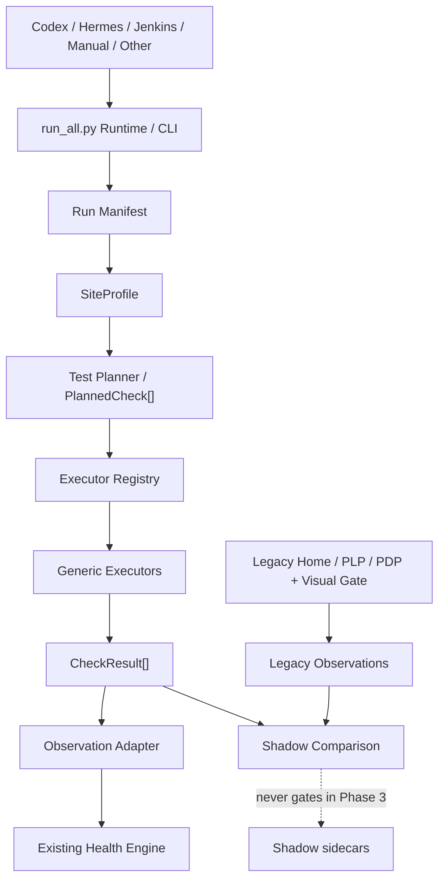

# Phase 3：Executor Runtime 与 Scheduler-neutral Health Platform

> 本文保留 Phase 3 当时的基线数字。当前 Shadow coverage、ATC 风险模型和
> history/readiness 合同以 `PHASE_3_5A_SHADOW_MATURITY.md` 为准。

实施日期：2026-08-14

本文件记录 Phase 3 的实际实现、验证证据和迁移边界。核心原则是：新链路只做
shadow sidecar，旧 Home/PLP/PDP runner、visual gate 和退出码仍是生产裁决来源。

## 1. Architecture Review

修改前的实际情况：

- Phase 1 的 Health Engine 已能消费 deterministic observation，并生成 Finding、
  Evidence、False-positive Control 和 JSON/HTML 报告；不需要重写。
- Phase 2 已能从 6 个旧 site YAML 生成 SiteProfile 与 PlannedCheck，但 Registry
  中的 executor key 只是字符串，尚不能解析为统一 callable。
- Home、PLP、PDP 的 legacy `run()` 同时拥有浏览器生命周期、导航/重试、DOM/
  功能检查、截图、baseline、observation 和 failure string，执行事实与结果表达
  高度耦合。
- legacy 输出同时存在 failure string、visual dict、deterministic dict 和页面汇总；
  没有统一的 executor result contract，也无法区分“网站确认失败”和“自动化未能
  验证”。
- `Jenkinsfile` 合理使用 `BUILD_NUMBER` 等 Jenkins 元数据；核心 Python 曾把
  `JENKINS_URL` 当作 CI 判定。Phase 3 将核心判定统一为通用 `CI=true`，Jenkins
  只在外围 adapter 设置 CI 和 scheduler metadata。
- 旧执行器仍依赖少量 `VISUAL_*` 全局运行状态。Phase 3 没有重写旧路径；新
  executor 则只能从注入的 `ExecutorContext` 获取 run、page、selector、policy 和
  artifact 信息。

最终依赖方向：



## 2. Executor Contract

合同严格拆开三个概念：

- Check：测什么，例如 `pdp.product_price.presence`；
- Executor：如何测，例如 `content.text_present`；
- Target：测哪个能力对象，例如 `product_price`。

统一 callable 形态是 `ExecutorContext -> CheckResult`。`ExecutorContext` 包含：

- `run_id`、`site_profile`、`page_profile`、`planned_check`；
- 注入的 Playwright `page` 与 `browser_context`；
- `runtime_policy`、`interaction_policy`；
- `artifact_context`、`target`、`selector_hint`；
- `timeout_ms`、`RetryPolicy`、`metadata`。

Executor 不读取 site config、run ID、scheduler 或 Jenkins 环境，也不写报告、不做
告警和 gate 决策。`ArtifactContext` 统一提供 run/site/page、screenshots、traces、
evidence 路径，并验证所有派生路径都位于 run root 内。

`RuntimePolicy.MONITOR` 硬性保持 shadow-only，并拒绝 baseline update、selector
rewrite、site config rewrite、Profile overwrite、HIGH_RISK 和 destructive action。
`TRANSACTIONAL_SAFE` 默认关闭。`DIAGNOSE` 与 `DISCOVER` 只有合同，Executor
Engine 对它们返回 `UNSUPPORTED`。

## 3. CheckResult Contract

`CheckResult` schema version 为 `1.0`，统一包含：

```text
result_id, check_id, site_id, page_id, page_type, page_url,
capability, executor_key, executor_version,
execution_status, health_status,
expected, actual, observations[], evidence[],
started_at, duration_ms, retry_count, error, metadata
```

`result_id` 与 evidence ID 由稳定输入生成；序列化时 URL、错误和 metadata 会经过
现有脱敏/清理逻辑。JSON 支持严格的 `to_dict` / `from_dict` round-trip。

ExecutionStatus 与既有 HealthStatus 独立：

| 场景 | ExecutionStatus | HealthStatus |
|---|---|---|
| 执行完成并确认正常 | `COMPLETED` | `PASS` |
| 执行完成并确认站点问题 | `COMPLETED` | `FAIL` |
| executor exception | `ERROR` | `UNVERIFIED` |
| Playwright/执行超时 | `TIMEOUT` | `UNVERIFIED` |
| policy 不允许 | `POLICY_BLOCKED` | `UNVERIFIED` |
| capability 不适用 | `SKIPPED` | `NOT_APPLICABLE` |
| executor 未注册 | `UNSUPPORTED` | `UNVERIFIED` |
| capability unknown/disabled | `SKIPPED` | `UNVERIFIED` |

模型验证会拒绝 `ERROR + FAIL`、`POLICY_BLOCKED + NOT_APPLICABLE` 等错误组合。

## 4. Executor Registry

第一版只注册 7 个通用 executor：

| Executor key | 行为 |
|---|---|
| `dom.element_presence` | 统计 attached 匹配节点，至少 1 个 |
| `dom.element_visible` | 判断组合 selector 中是否存在可见节点 |
| `dom.element_enabled` | 判断第一个可见匹配控件是否 enabled |
| `dom.element_count` | 与 `expected_minimum_count` 比较 |
| `content.text_present` | 读取第一个可见匹配项的非空文本 |
| `navigation.url_reachable` | 校验最终 HTTP(S) URL 与主文档状态 |
| `interaction.safe_click` | 仅执行 Playwright `trial=True` actionability 检查 |

Registry 在构造时校验 key 唯一、version/description 非空、callable 存在。未知 key
解析为 `None`，Executor Engine 转成 `UNSUPPORTED + UNVERIFIED`。多个 Check 复用
同一机制，例如 PDP title/price 都使用 `content.text_present`；没有引入站点专用
executor。visual executor 因会扩大 baseline/artifact 改造范围，本轮未实现。

## 5. Shadow Coverage

显式语义 mapping 位于 `shadow_comparison.py`，不使用字符串相似度。当前映射：

| Legacy | New PlannedCheck | Match |
|---|---|---|
| Home `dom_modules` | `global.navigation.health` | PARTIAL |
| PLP `dom_modules` | `plp.product_grid.health` | PARTIAL |
| PLP `product_count` | `plp.product_grid.health` | PARTIAL |
| PLP `pagination` | `plp.pagination.health` | EXACT |
| PLP visual `product_grid` | `plp.product_grid.health` | PARTIAL |
| PDP `product_content` | title + price presence | PARTIAL |
| PDP `dom_modules` | `pdp.gallery.health` | PARTIAL |
| PDP `add_to_cart_state` | `commerce.add_to_cart.health` | EXACT（policy-only） |
| PDP visual `gallery` | `pdp.gallery.health` | PARTIAL |
| PDP visual `info` | title + price presence | PARTIAL |

未映射的 visual full-page/first-screen/core snapshot、variant change/selection、聚合
DOM presence 和第三方/动态区域仍明确列入 `missing_in_new`；不会用名称接近程度虚报
覆盖率。

## 6. Shadow Comparison

Shadow 在旧 runner 完成后、旧结果写盘和 gate 返回前运行。它复用同一个 run ID 和
同一 site/page/viewport 范围，但拥有独立且注入的浏览器 context。任何 shadow
异常都会 fail-open，只打印 warning；shadow observations 标记
`affects_exit_code=false`，且只进入独立的 secondary Health Engine summary。

根级 sidecar：

- `shadow-check-results.json`；
- `shadow-observations.json`；
- `shadow-comparison.json`。

2026-08-14 的真实 `lavetir_US` desktop PDP 烟测（run ID
`phase3-shadow-smoke`）结果：

| Metric | Value |
|---|---:|
| Legacy checks | 11 |
| Selected-page Planned checks | 16 |
| Mapped legacy checks | 5 |
| Exact relationships | 1 |
| Partial relationships | 6 |
| Missing in new | 6 |
| Completed executors | 4 |
| Unsupported executors | 1 |
| Overall coverage | 45.45% |
| Critical coverage | 44.44% |
| Result parity | 100.00%（6 relationships） |
| Evidence parity | 100.00%（3 unique results） |
| Policy regressions | 1 |
| Migration status | `SHADOW` |
| Recommended readiness | `SHADOW` |

4 个实际执行项（URL、gallery、price、title）均为 `COMPLETED + PASS`。另外 1 项
`POLICY_BLOCKED`、10 项 `SKIPPED`、1 项 `UNSUPPORTED`。policy regression 来自
legacy 的只读 add-to-cart control check 与新 Planner 的 TRANSACTIONAL_SAFE 分类
不一致；新链没有点击或提交。这个差异被保留为迁移工作，而不是放宽 MONITOR。

该次完整 CLI 烟测的旧 visual gate 因现有 first-screen 差异及缺少
`product_main` baseline 返回 1；shadow 仍成功产出，且没有初始化或更新 baseline。
这同时证明 shadow 不能掩盖旧 gate。无论指标如何，Phase 3 的实际
`migration_status` 永远是 `SHADOW`；推荐值也不会自动切换生产路径。

## 7. Scheduler-neutral Runtime

`run_all.py` 仍是唯一稳定入口。核心 Runtime 只接收统一 metadata：

- scheduler：`MANUAL | CODEX | HERMES | JENKINS | OTHER`；
- trigger：`MANUAL | SCHEDULED | OTHER`；
- mode：`MONITOR | DIAGNOSE | DISCOVER`。

代码中不存在按 scheduler 改 selector、policy、baseline、severity 或 check logic 的
分支。核心 Python 不读取 `BUILD_NUMBER`、`BUILD_URL`、`JOB_NAME`、`WORKSPACE` 或
`JENKINS_URL`。Jenkinsfile 仅作为 adapter 传入 `--scheduler JENKINS`、trigger，
并设置通用 `CI=true`。Codex/Hermes 无需任何 Jenkins 变量。

每次 Runtime 在启动旧 runner 前写 RUNNING manifest，在退出前写最终 manifest、
`run-summary.json` 和稳定 stdout。MONITOR 强制关闭 baseline init 与 side-effect
flow；DIAGNOSE/DISCOVER 直接返回 RESERVED/UNSUPPORTED，不启动浏览器。

## 8. Run Manifest

`run-manifest.json` schema version 为 `1.0`，包含：

```json
{
  "schema_version": "1.0",
  "run_id": "phase3-shadow-smoke",
  "trigger": "MANUAL",
  "scheduler": "MANUAL",
  "started_at": "2026-08-14T07:28:14.224+00:00",
  "finished_at": "2026-08-14T07:30:42.697+00:00",
  "mode": "MONITOR",
  "sites": ["lavetir_US"],
  "ai_enabled": false,
  "transactional_safe_enabled": false,
  "baseline_update_enabled": false,
  "shadow_executor_enabled": true,
  "config_reference": {
    "path": "configs/sites/lavetir_US.yaml",
    "sha256": "<configuration digest>"
  },
  "runtime_metadata": {
    "viewport": "desktop",
    "page": "product",
    "artifact_root": "artifacts",
    "scheduler_behavior_invariant": true,
    "legacy_exit_code": 1
  },
  "run_status": "FAILED",
  "pinned": false,
  "artifact_types": ["visual-results", "health-report", "run-manifest"]
}
```

`runtime_metadata` 会递归删除 token、password、secret、credential、signature、key、
session、authorization 等敏感字段，再使用现有 evidence sanitizer。Manifest 预留
`run_status`、时间、site、`pinned` 和 artifact types，供 Phase 3.5 retention 使用，
本轮不做自动清理。

## 9. CLI

Codex Scheduled Task 示例：

```powershell
.\.venv\Scripts\python.exe -u run_all.py `
  --site lavetir_US --viewport all --page all `
  --scheduler CODEX --trigger SCHEDULED `
  --run-id codex-20260814-140000 --shadow-executor
```

Hermes cron 只需把 scheduler 改为 `HERMES`；Manual 改为 `MANUAL`。Jenkinsfile 已
使用同一命令并传入 `JENKINS`，shadow 默认仍关闭。

稳定 stdout 尾部：

```text
HEALTH_RUN_COMPLETE
run_id=...
status=...
sites=1
failed=...
warnings=...
report=...
manifest=...
summary=...
shadow=...
```

当前兼容退出码：`0` 表示旧 gate 通过，`1` 表示旧 runner 非零，`2` 表示外围
Runtime orchestration error 或保留 mode。`--validate-config` 保持原来的 0/1；
argparse 参数错误使用 2。由于 legacy runner 本身尚未区分“确认健康失败”和“内部
执行故障”，Runtime 不伪造更细的 code 3 语义。

## 10. Backwards Compatibility

- Legacy Home/PLP/PDP `run()`、重试和浏览器生命周期未被新 Executor 替换；
- visual comparison、baseline 查找和 Jenkins gray gate 仍由旧链裁决；
- shadow 默认关闭，启用后也不进入 failure list 或旧 exit code；
- Health JSON/HTML 报告仍由既有 Health Engine 生成；
- 旧 `visual-results.json` 与 `reports/*` 路径继续生成；
- Jenkins trigger allowlist、credential binding、archive/evaluation 顺序和 0/1 gate
  保持不变；只增加通用 metadata 与新 JSON artifact 归档；
- 6 个站点 YAML 无需迁移即可生成 Profile、Plan 和运行；
- MONITOR 不自动创建、修改 baseline、selector、site config 或 Profile。

## 11. Files Changed

Phase 3 新增：

- `health/execution_models.py`：RuntimePolicy、ArtifactContext、ExecutorContext、
  ExecutionStatus、CheckResult；
- `health/executors.py`、`executor_registry.py`、`executor_engine.py`：7 个通用
  executor、解析、preflight、retry/error/status 归一化；
- `health/check_result_adapter.py`：CheckResult 到 legacy observation；
- `health/shadow_runtime.py`、`shadow_comparison.py`：shadow pipeline、显式 mapping、
  coverage/parity/readiness；
- `runtime/run_manifest.py`、`runtime/run_summary.py`：scheduler-neutral run 合同；
- `tests/test_executor_runtime_phase3.py`：Phase 3 合同测试；
- 本文件。

Phase 3 修改：

- `health/capability_registry.py`、`profile_adapter.py`：将高确定性 Home/PLP/PDP
  PlannedCheck 绑定通用 executor 与 selector hint；
- `health/evidence.py`：保留 CheckResult 的结构化 evidence；
- `health/config.py`、`configs/settings.yaml`：默认关闭的 shadow 配置；
- `runner/main.py`：fail-open shadow sidecar；
- `run_all.py`：统一 CLI、MONITOR guard、manifest/summary/stdout；
- `utils/visual.py`、`runtime/gray_summary.py`：只使用通用 CI metadata；
- `Jenkinsfile`：作为 adapter 传 scheduler/trigger，并归档新合同产物；
- 对应 runtime/Jenkins tests 与 Phase 2 文档。

## 12. Tests

2026-08-14 最终验证：

- 完整 unittest suite：258 tests passed；
- Phase 3 专项：33 tests passed；
- Jenkinsfile 静态合同：20 tests passed；
- 6 个 site config：6/6 passed，每个生成 3 个页面、31 个 PlannedCheck；
- `compileall`：passed；
- `git diff --check`：passed；
- 核心 Python 对 Jenkins 环境变量引用扫描：0；
- 无 Jenkins 环境的 CLI/manifest smoke：passed；
- 真实 Playwright shadow smoke：sidecar 成功，旧 gate 保持 exit 1，baseline 未更新；
- Ruff、mypy、Flake8 当前未安装，因此未临时引入新的静态工具。

Phase 3 专项覆盖 Registry、ExecutorContext/Result/status、timeout/error、可见 selector
union、Observation Adapter、Shadow、Manifest、secret filtering、CODEX/HERMES 和无
Jenkins CLI。完整 suite 还覆盖 legacy runner、visual policy/baseline、reports 与
Jenkins 兼容合同。

真实浏览器烟测限定为一个现有站点、一个 desktop viewport、一个 PDP；只新增根级
JSON sidecar，没有 shadow screenshot/trace，也没有无边界重复 artifact。

## 13. Current Limitations

- 只有 7 个基础 executor；visual region executor 尚未实现；
- 尚有 legacy executor key 未绑定，按合同报告 `UNSUPPORTED`；
- shadow 使用同 run 的独立 browser context，而非复用 legacy page object；
- coverage mapping 目前是静态显式表，尚未覆盖全部 visual/variant/聚合检查；
- 只支持既有 Home/PLP/PDP；无 Search、Cart、Login、Account、Checkout 执行扩展；
- AI 保持可选且 shadow 强制关闭 AI；无 Discovery、Health Score、History Store、
  alert、performance/a11y/SEO；
- `run-summary.json` 当前是单 site 合同；多站统一 orchestration 尚未实现；
- 未实现 HTML shadow comparison、自动晋级、完整 retention/cleanup/pin 操作；
- legacy runner 仍把 confirmed gate failure 与内部非零统一为 exit 1。

## 14. Phase 3.5 / Phase 4 Recommendation

Phase 3.5 应先提升可观测性与运营安全，而不是切 gate：

1. 用多次固定 Home/PLP/PDP shadow run 扩充显式 mapping，并按 viewport/site 保存
   consecutive stable run 指标；
2. 解决 add-to-cart“只读 control health”与 transactional action 的语义拆分，消除
   当前 policy regression，但不要执行真实点击提交；
3. 增加 bounded retention、pin/unpin、artifact inventory 和单站/多站 summary；
4. 评估 `visual.region_snapshot` 时复用现有 screenshot/baseline contract，仍先保持
   non-gating；
5. 只有 coverage、critical coverage、result/evidence parity 和稳定运行历史达到门槛
   后，才人工评审 `ADVISORY`，不得自动晋级。

Phase 4 再考虑 config/sitemap based Discovery、Profile merge/approval 和 evidence-pack
AI analyzer adapter。Discovery、AI diagnosis 或新页面域不得与 gate 切换同时进行。
