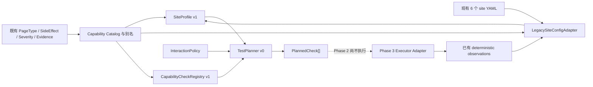

# Site Profile v1、Capability Check Registry v1 与 Planner v0

实施日期：2026-08-14

后续状态：Phase 3 已完成 Executor Contract、CheckResult、Shadow Dual-run 与
Scheduler-neutral Runtime。本文仍记录 Phase 2 的设计基线；执行层现状请参阅
[`EXECUTOR_RUNTIME_PHASE3.md`](EXECUTOR_RUNTIME_PHASE3.md)。

## 1. 本阶段目标与边界

本阶段建立后续 Discovery、测试规划、历史分析和 AI 分析共同依赖的合同层，不增加浏览器检查数量，也不切换现有 runner 的执行方式。

已实现：

- Site Profile v1；
- 旧站点 YAML 到 Site Profile 的无迁移 Adapter；
- Capability Check Registry v1；
- 只生成计划、不执行动作的 Test Planner v0；
- `site-profile.json` 与 `test-plan.json` artifact；
- Health JSON/HTML 对 Profile 和 Plan 的引用；
- 配置校验与合同测试。

明确未实现：AI Provider、Health Score、自动 Discovery、完整性能/Accessibility/SEO、自动 Self-Healing、自动 baseline 更新，以及由新 Planner 驱动 Playwright 执行。

## 2. 对第一阶段架构的实际发现

第一阶段已经提供以下可复用合同：

- `PageType`、`SideEffectLevel`、`Severity`、`EvidenceType` 和 `HealthStatus`；
- `ConfigCapabilityDetector`，可从 modules、selector、plugins、readonly interaction 和页面类型提取确定性信号；
- 结构化 observation、evidence、finding、false-positive control；
- Health Engine 与 JSON/HTML sidecar report；
- runner 保持 Home/PLP/PDP 固定执行和旧退出码；
- artifact 按 run/site/viewport/page 管理。

第一阶段的 `CapabilitySignal.detected: bool` 描述的是检测信号，无法表达长期知识中的 `ABSENT`、`UNKNOWN` 和 `NOT_APPLICABLE`。因此本阶段没有替换 Detector，而是在它上方增加 Site Profile Adapter，将检测信号转换为知识状态。

## 3. 单向依赖



Health Engine 不反向依赖 Site Profile。Profile 描述知识，Health Run 描述某次运行事实，两者通过 artifact reference 关联。

## 4. SiteProfile v1 Schema

顶层结构：

```json
{
  "schema_version": "1.0",
  "profile_id": "mondressy_US:site-profile-v1",
  "generated_at": "2026-08-14T00:00:00.000+00:00",
  "site_identity": {},
  "pages": [],
  "capabilities": [],
  "interaction_policy": {},
  "metadata": {},
  "summary": {}
}
```

### 4.1 Site Identity

```json
{
  "site_id": "mondressy_US",
  "base_url": "https://mondressy.com",
  "site_type": "ECOMMERCE",
  "platform": "SHOPIFY",
  "locale": "en-US",
  "region": "US",
  "metadata": {
    "field_sources": {
      "base_url": "CONFIG",
      "platform": "INFERRED"
    }
  }
}
```

`site_type` 支持 `ECOMMERCE / CONTENT / UNKNOWN`。
`platform` 支持 `SHOPIFY / CUSTOM / UNKNOWN`。

Adapter 只有在 URL 同时呈现 `/collections/` 和 `/products/` 路由特征时才推断 Shopify；否则保持 UNKNOWN。模型本身不依赖 Shopify。

### 4.2 Pages

```json
{
  "page_id": "product",
  "page_type": "PDP",
  "url": "https://example.com/products/example",
  "source": "CONFIG",
  "confidence": 1.0,
  "enabled": true,
  "representative": true,
  "metadata": {
    "config_key": "product",
    "legacy_adapter": true
  }
}
```

页面类型复用第一阶段 `PageType`，并增加 `OTHER`：

`HOME / PLP / PDP / SEARCH / CART / LOGIN / ACCOUNT / CHECKOUT_ENTRY / CONTENT / OTHER`。

知识来源：

`CONFIG / DISCOVERY / MANUAL / INFERRED / AI_INFERRED`。

当前 Adapter 只产生 CONFIG、MANUAL 和 INFERRED；DISCOVERY 与 AI_INFERRED 仅预留合同，不触发任何外部调用。

### 4.3 Capabilities

```json
{
  "name": "add_to_cart",
  "scope": "PAGE",
  "status": "PRESENT",
  "source": "CONFIG",
  "confidence": 1.0,
  "page_type": "PDP",
  "page_id": "product",
  "selector_hint": ["css", "button[name='add']"],
  "interaction_policy": "TRANSACTIONAL_SAFE",
  "default_interaction_allowed": false,
  "interaction_reason": "transactional_opt_in_required",
  "metadata": {}
}
```

Capability 同时提供 PAGE 和 SITE scope。站点级状态由页面级知识聚合，也可被可选人工配置覆盖。

Capability 状态：

| 状态 | 含义 |
|---|---|
| PRESENT | 有配置、固定规则、已通过 observation 或人工信息确认存在 |
| ABSENT | 明确确认不存在；不能由“配置没写”推断 |
| UNKNOWN | 当前信息不足，不能视为失败 |
| NOT_APPLICABLE | 对该页面或业务明确不适用 |

Profile 中不会出现某次运行的 PASS/FAIL。运行结果继续由 Health Engine 的 Observation/Finding 表达。

## 5. 旧 YAML Adapter

六个现有站点不需要增加任何字段：

```text
旧 site YAML
  → 读取 site/base_url/pages/modules/selectors/plugins
  → ConfigCapabilityDetector 提取信号
  → canonical capability alias
  → LegacySiteConfigAdapter
  → SiteProfile v1
```

当前 `home / collection / product` 自动映射为 `HOME / PLP / PDP`。站点 ID 后缀 `_US`、`_UK` 只作为 locale/region 推断，并在 metadata 中标记为 INFERRED。

现有 observation 仅在 `deterministic_check` 为 passed 时用于加强 PRESENT 信号；失败 observation 不会把 capability 错误标记为 ABSENT。

### 5.1 可选覆盖

下面配置完全可选，现有站点无需迁移：

```yaml
site_profile:
  site_identity:
    platform: CUSTOM
    locale: en-US
    region: US
  pages:
    search:
      page_type: SEARCH
      url: https://example.com/search
      source: MANUAL
      confidence: 1.0
      enabled: true
      representative: true
  capabilities:
    site:
      search:
        status: PRESENT
        source: MANUAL
        confidence: 1.0
    pages:
      product:
        size_selector:
          status: ABSENT
          source: MANUAL
          confidence: 1.0
```

## 6. Capability Check Registry v1

Registry 是静态 Python 合同，不把大量 executor 配置搬进 YAML。每个条目包含：

```python
CapabilityCheck(
    check_id="pdp.product_price.presence",
    capability="product_price",
    applicable_page_types=(PageType.PDP,),
    interaction_policy=SideEffectLevel.SAFE,
    severity=Severity.HIGH,
    executor="content.text_present",
    evidence_requirements=(EvidenceType.SELECTOR, EvidenceType.DOM),
    enabled_by_default=True,
)
```

当前示例映射：

| Capability | Check ID | 默认交互 |
|---|---|---|
| navigation | `global.navigation.health` | SAFE |
| product_grid | `plp.product_grid.health` | SAFE |
| filter | `plp.filter.health` | SAFE |
| pagination | `plp.pagination.health` | SAFE |
| product_title | `pdp.product_title.presence` | SAFE |
| product_price | `pdp.product_price.presence` | SAFE |
| product_gallery | `pdp.gallery.health` | SAFE |
| size_selector | `pdp.size_selector.health` | SAFE |
| variant_selector | `pdp.variant_selector.health` | SAFE |
| add_to_cart_control | `commerce.add_to_cart.control_health` | SAFE、只观察不点击 |
| add_to_cart_action | `commerce.add_to_cart.action_health` | TRANSACTIONAL_SAFE、默认阻断 |
| buy_now | `commerce.buy_now.health` | HIGH_RISK、默认禁用 |
| checkout_submit | `checkout.submit.health` | HIGH_RISK、默认禁用 |

Registry 构造时立即验证：

- `check_id` 唯一；
- capability 非空；
- applicable page type 非空且有效；
- interaction/severity/evidence type 有效；
- executor 非空；
- `enabled_by_default` 必须为 boolean。

未知 capability 查询返回空列表，不会导致 runner 或 Planner 崩溃。

`executor` 是稳定的 executor contract key。Phase 2 的 Planner 只输出该 key；
Phase 3.5A 已将其中 10 个通用 key 绑定到统一 callable。尚未绑定的旧 key在 shadow
执行时返回 `UNSUPPORTED + UNVERIFIED`，不会导致整个 run 崩溃。

## 7. Planner v0 工作方式

输入：

```text
SiteProfile
+ page capability status
+ CapabilityCheckRegistry
+ InteractionPolicy
+ 本次显式 interaction opt-in（默认空）
```

输出：`TestPlan`，其中包含稳定排序的 `PlannedCheck[]`。

每个 PlannedCheck 包含 check、页面、URL、executor、证据要求、严重度、交互级别、是否允许执行、原因和初始 health status。

### 7.1 规划语义

| Profile Capability | 计划行为 | Disposition | 初始 Health Status |
|---|---|---|---|
| PRESENT + SAFE allowed | 生成且可执行 | READY | UNVERIFIED，等待执行结果 |
| PRESENT + policy denied | 生成但不执行 | POLICY_BLOCKED | UNVERIFIED |
| ABSENT | 不生成 check | — | — |
| UNKNOWN | 生成覆盖缺口但不执行 | CAPABILITY_UNKNOWN | UNVERIFIED |
| NOT_APPLICABLE | 保留说明但不执行 | NOT_APPLICABLE | NOT_APPLICABLE |
| check/page disabled | 生成但不执行 | DISABLED | UNVERIFIED |

`SKIPPED` 没有被新增为 HealthStatus。被策略阻止的能力仍然适用且可能重要，因此使用 `UNVERIFIED`；使用 `NOT_APPLICABLE` 会错误掩盖覆盖缺口。

### 7.2 Transactional 与 High Risk

默认运行：

- SAFE → READY；
- TRANSACTIONAL_SAFE → POLICY_BLOCKED，除非本次计划明确 opt-in capability/check；
- HIGH_RISK → 即使显式请求也要求 `high_risk_allowed=true`，默认仍拒绝；
- payment、submit_order、checkout_submit、account_creation、real_form_submission 和 form_submit 是受保护动作，不能被配置降级为 SAFE。

站点可以通过现有 optional `health_check.interaction_policy.capability_overrides` 覆盖非受保护能力：

```yaml
health_check:
  interaction_policy:
    capability_overrides:
      add_to_cart: SAFE
```

该覆盖会进入 Profile artifact，并由 Planner 使用。

## 8. Artifact 与 Health Report

每次正常 runner 完成旧结果写入后，sidecar 报告层额外生成：

```text
artifacts/<run_id>/site-profile.json
artifacts/<run_id>/test-plan.json
artifacts/<run_id>/health-report.json
artifacts/<run_id>/health-report.html
```

Health Report 只包含：

- `site_profile_reference`；
- `site_profile_summary`；
- `test_plan_reference`；
- `test_plan_summary`。

完整 Profile 不会重复嵌入 Health JSON 或 HTML。Jenkins 显式归档 Profile 与 Plan。

Profile/Plan 生成错误被限制在 sidecar 内，不改变旧 visual-results、退出码或 Jenkins gate。

## 9. Backwards Compatibility

以下行为保持不变：

- 六个 site YAML 无必填新字段；
- runner 的 `ALL_PAGES` 仍是 home、collection、product；
- 旧 page object 和 check 继续直接执行；
- Planner 本阶段不控制 Playwright；
- visual baseline、初始化保护、diff、artifact retention 不变；
- `reports/visual-results.json` 格式不变；
- runtime/visual gate 和进程退出码不变；
- Jenkins 原裁决顺序不变，只增加两个归档文件；
- AI 仍默认关闭，Profile 构建没有 AI 调用。

## 10. 修改与新增文件

主要新增：

- `health/site_profile.py`：Schema、enum、序列化与验证；
- `health/profile_adapter.py`：旧 YAML/observation Adapter；
- `health/capability_registry.py`：静态 Registry 和校验；
- `health/planner.py`：PlannedCheck 与 Planner；
- `health/profile_artifacts.py`：Profile/Plan bundle 与落盘；
- `health/file_io.py`：原子 JSON/text 写入；
- `tests/test_site_profile_registry.py`：第二阶段合同测试。

主要修改：

- `health/models.py`：复用 PageType 并增加 OTHER；Health Report 增加引用字段；
- `health/capabilities.py`：统一 capability 别名、风险和页面能力集合；
- `health/interaction_policy.py`：支持 capability override 与受保护动作；
- `health/reporting.py`：生成并引用 Profile/Plan；
- `runner/main.py`：仅打印新 artifact 路径；
- `run_all.py`：验证 Profile/Registry/Plan 转换；
- `configs/settings.yaml`：增加空的 optional override mapping；
- `Jenkinsfile`：归档 Profile/Plan。

## 11. 当前尚未实现

- 未知 URL 的 sitemap/link Discovery；
- 多代表页面和 URL 去重/优先级策略的完整 Planner；
- 由 Planner 驱动 runner；
- Search、Cart、Login、Checkout 的真实执行器；
- Profile 持久化合并、版本差异、人工审批和历史 Store；
- Discovery/AI_INFERRED 对 Profile 的更新冲突策略；
- AI Provider、Health Score、完整性能/a11y/SEO；
- 自动 selector 或 baseline 修改。

## 12. Phase 2 原始下一阶段建议（已由 Phase 3 落地）

Phase 2 当时建议先建设 `Executor Adapter Interface + dual-run shadow planner`：

1. 给 READY PlannedCheck 绑定统一 executor callable；
2. 先让 Planner 在 shadow mode 对照旧 runner，不改变退出码；
3. 验证计划覆盖与旧执行记录一一对应；
4. 再引入 sitemap/config based Discovery v1；
5. 历史存储建立后才允许 Profile 增量合并和可信告警。

Phase 3 已完成前 3 项，并继续保持 AI 与旧 runner 切换在范围外。未绑定的
legacy page-level key 会被明确报告为 `UNSUPPORTED`，不会被伪装成已覆盖。

## 13. 本阶段验证结果

2026-08-14 本地验证：

- `python -m unittest discover -s playwright_checks/tests -p 'test_*.py' -q`：225 tests passed；
- 六个现有站点逐一执行 `python run_all.py --validate-config --site <site>`：6/6 passed；
- 每个旧配置均转换为 `ECOMMERCE` Profile、HOME/PLP/PDP 三个代表页面，并生成 31 个 PlannedCheck；
- `python -m compileall -q playwright_checks run_all.py`：passed；
- `git diff --check`：passed；
- 项目未配置或安装 Ruff、mypy、Flake8，因此没有额外静态检查结果；
- 使用现有 `local-paypal-fix-matrix-2` observation 重放 sidecar：Profile schema 1.0、Plan schema 0.1、Health Report 引用和 HTML 摘要均可生成。该重放不是新的线上浏览器健康结论。

该烟测 Profile 含 3 个页面和 72 条站点/页面 capability 记录；Plan 含 31 项，其中 12 项 READY、16 项因 capability 未确认而 UNVERIFIED、2 项被交互策略阻止、1 项默认禁用。UNKNOWN 和策略阻止均未被错误升级为 FAIL。
